# MI Bridge — Architecture Diagram

> End-to-end sequence of every agent invocation, tool call, data structure, and response in the MI Bridge simulation pipeline.

---

## Full Workflow Sequence

```mermaid
sequenceDiagram
    autonumber

    %% ── Participants ────────────────────────────────────────────────────────
    participant DT  as 📡 Dynatrace<br/>(Alert Source)
    participant API as 🌐 FastAPI<br/>/api/run
    participant ORC as 🧠 Orchestrator<br/>MIBridgeOrchestrator
    participant IMP as ⚡ Impact Agent<br/>ImpactAnalysisAgent
    participant SIM as 🔍 Similar Agent<br/>SimilarIncidentAgent
    participant SUM as 📝 Summarizer Agent<br/>MISummarizerAgent
    participant RCA as 🔬 RCA Agent<br/>RCAAgent
    participant mDT as 🔧 mock_dynatrace
    participant mSN as 🔧 mock_servicenow
    participant mSP as 🔧 mock_splunk
    participant mPD as 🔧 mock_pagerduty
    participant LLM as 🤖 LLM<br/>(Claude / DryRun)

    %% ════════════════════════════════════════════════════════════════════════
    %% INGESTION
    %% ════════════════════════════════════════════════════════════════════════
    rect rgb(30, 20, 20)
        Note over DT,API: 🔴 INGESTION — Alert fires
        DT  ->> API: POST /api/run<br/>{ incident_id, source, severity: "P1",<br/>  title, affected_services,<br/>  error_rate, timestamp }
        API ->> ORC: handle_alert(RawAlert)<br/>creates IncidentContext{ id, alert, timings }
    end

    %% ════════════════════════════════════════════════════════════════════════
    %% PHASE 1 — PARALLEL
    %% ════════════════════════════════════════════════════════════════════════
    rect rgb(20, 25, 40)
        Note over ORC,LLM: ⚡ PHASE 1 — Parallel triage (asyncio.gather)

        ORC ->> IMP: analyze(IncidentContext)
        ORC ->> SIM: find_similar(IncidentContext)

        %% ── Impact Agent ────────────────────────────────────────────────
        rect rgb(25, 35, 55)
            Note over IMP,mDT: Impact Agent — tool calls
            IMP ->> mDT: get_service_metrics(affected_services)<br/>→ response_time_p99_ms, error_rate_pct,<br/>  throughput_rps, db_pool_active/max
            mDT -->> IMP: { "inventory-service": { p99: 18340ms,<br/>  error_rate: 42.1%, db_pool: 10/10 }, … }

            IMP ->> mDT: get_distributed_traces(affected_services)<br/>→ trace spans across services
            mDT -->> IMP: [{ trace_id, root_service, total_ms: 18420,<br/>  status: "ERROR", spans: [ … ] }]

            IMP ->> LLM: system: "You are an Impact Analysis agent…"<br/>user: alert + metrics + traces JSON
            LLM -->> IMP: ImpactAnalysisOutput JSON<br/>{ blast_radius, users_impacted: 47000,<br/>  revenue_per_min: "$18,400",<br/>  severity: "ESCALATE", confidence: 0.94 }
        end

        %% ── Similar Incident Agent ──────────────────────────────────────
        rect rgb(25, 40, 35)
            Note over SIM,mSN: Similar Incident Agent — tool calls
            SIM ->> mSN: search_past_incidents(keywords)<br/>→ incident history search
            mSN -->> SIM: [{ incident_id: "INC-1843",<br/>  title: "inventory-service DB pool starvation",<br/>  root_cause, resolution,<br/>  resolution_time_minutes: 28,<br/>  tags: [hikaricp, connection-pool] }]

            SIM ->> LLM: system: "You are a Similar Incident agent…"<br/>user: alert + past incidents JSON
            LLM -->> SIM: SimilarIncidentOutput JSON<br/>{ incidents: [top3 ranked by score],<br/>  top_match: INC-1843 (score: 0.97),<br/>  suggested_runbook: "Increase HikariCP<br/>  maximumPoolSize from 10 to 30…" }
        end

        IMP -->> ORC: ImpactAnalysisOutput ✓
        SIM -->> ORC: SimilarIncidentOutput ✓
        Note over ORC: IncidentContext updated<br/>impact_analysis ✓  similar_incidents ✓
    end

    %% ════════════════════════════════════════════════════════════════════════
    %% PHASE 2 — SUMMARIZER
    %% ════════════════════════════════════════════════════════════════════════
    rect rgb(20, 35, 35)
        Note over ORC,LLM: 📝 PHASE 2 — Summarizer (sequential)

        ORC ->> SUM: summarize(IncidentContext)<br/>receives: alert + impact_analysis + similar_incidents

        rect rgb(25, 45, 45)
            Note over SUM,mPD: Summarizer Agent — tool calls
            SUM ->> mPD: get_oncall_roster(blast_radius_services)<br/>→ who is on-call right now
            mPD -->> SUM: { "inventory-service": { oncall: "James Wu",<br/>  slack: "@james.wu", phone: "+1-415-…",<br/>  escalation_1: "Sarah Chen (Eng Mgr)" }, … }

            SUM ->> mPD: get_service_ownership(blast_radius_services)<br/>→ team channels, runbook URLs, SLO status
            mPD -->> SUM: { "inventory-service": { team: "Inventory Platform",<br/>  slack_channel: "#inventory-platform-incidents",<br/>  slo_current_pct: 57.9 }, … }

            SUM ->> LLM: system: "You are an MI Summarizer agent…"<br/>user: full context (alert + impact + similar<br/>  + oncall roster + ownership) JSON
            LLM -->> SUM: MISummaryOutput JSON<br/>{ headline: "P1 ACTIVE: Checkout down…",<br/>  narrative: "…", timeline: [ events ],<br/>  teams_to_engage: [ teams + contacts ],<br/>  next_steps: [ ordered actions ] }
        end

        SUM -->> ORC: MISummaryOutput ✓
        Note over ORC: IncidentContext updated<br/>mi_summary ✓
    end

    %% ════════════════════════════════════════════════════════════════════════
    %% PHASE 3 — RCA
    %% ════════════════════════════════════════════════════════════════════════
    rect rgb(30, 20, 40)
        Note over ORC,LLM: 🔬 PHASE 3 — Root Cause Analysis (sequential)

        ORC ->> RCA: analyze(IncidentContext)<br/>receives: full context incl. mi_summary

        rect rgb(40, 25, 55)
            Note over RCA,mSP: RCA Agent — tool calls
            RCA ->> mSP: query_error_logs(blast_radius_services)<br/>→ structured exception logs from Splunk
            mSP -->> RCA: [{ timestamp, service: "inventory-service",<br/>  level: "ERROR",<br/>  exception: "HikariPool$PoolTimeoutException",<br/>  hikaricp: { max: 10, active: 10,<br/>  idle: 0, pending_threads: 143 } }]

            RCA ->> mSN: get_active_change_requests(services)<br/>→ recent deploys & config changes
            mSN -->> RCA: [{ cr_id: "CR2077",<br/>  title: "Tune HikariCP pool settings",<br/>  deployed_at: "12:04 UTC",<br/>  config_change: { param: "maximum-pool-size",<br/>  old: "20", new: "10" },<br/>  rollback_plan: "Revert to 20 via<br/>  config map + rolling restart" }]

            RCA ->> mSN: search_past_incidents(keywords)<br/>→ historical context for RCA reasoning
            mSN -->> RCA: [ past incidents with matching root causes ]

            RCA ->> LLM: system: "You are an RCA agent…"<br/>user: full context + error logs<br/>  + change requests + history JSON
            LLM -->> RCA: RCAOutput JSON<br/>{ probable_root_causes: [<br/>    { rank:1, cause: "CR2077 reduced pool<br/>      size from 20→10 under flash-sale load",<br/>      confidence_pct: 96, evidence: "…" }],<br/>  rollback_candidate: "CR2077",<br/>  remediation_steps: [ ordered steps ],<br/>  evidence_trail: [ sources + findings ] }
        end

        RCA -->> ORC: RCAOutput ✓
        Note over ORC: IncidentContext fully populated<br/>all phases complete ✓
    end

    %% ════════════════════════════════════════════════════════════════════════
    %% RESPONSE ASSEMBLY
    %% ════════════════════════════════════════════════════════════════════════
    rect rgb(20, 35, 20)
        Note over ORC,API: ✅ RESPONSE ASSEMBLY
        ORC -->> API: IncidentContext{ alert, impact_analysis,<br/>  similar_incidents, mi_summary, rca,<br/>  phase_timings, log_entries }
        API -->> DT: JSONResponse 200<br/>{ full context + log_entries annotated<br/>  with phase numbers + wall_total_seconds }
    end
```

---

## Data Structures at Each Phase Boundary

```mermaid
block-beta
    columns 4

    block:ALERT:1
        A1["📡 RawAlert\n─────────\nincident_id\nsource\nseverity: P1\ntitle\naffected_services[]\nerror_rate\ntimestamp\nraw_payload{}"]
    end

    space

    block:P1OUT:1
        B1["⚡ ImpactAnalysisOutput\n─────────────────────\nblast_radius[]\nusers_impacted: 47,000\nrevenue_per_min: $18,400\nseverity: ESCALATE\nconfidence: 0.94\nreasoning"]
        B2["🔍 SimilarIncidentOutput\n────────────────────────\nincidents[top 3 ranked]\ntop_match: INC-1843\n  score: 0.97\nsuggested_runbook\nreasoning"]
    end

    space

    block:P2OUT:1
        C1["📝 MISummaryOutput\n──────────────────\nheadline\nnarrative\ntimeline[]\nteams_to_engage[]\nnext_steps[]"]
    end

    space

    block:P3OUT:1
        D1["🔬 RCAOutput\n────────────\nprobable_root_causes[]\nrollback_candidate: CR2077\nremediation_steps[]\nevidence_trail[]\ncorrelated_CRs[]"]
    end

    ALERT --> P1OUT
    P1OUT --> P2OUT
    P2OUT --> P3OUT
```

---

## Tool Call Map — Which Agent Calls Which Tool

```mermaid
graph LR
    subgraph AGENTS["🤖 Agents"]
        IMP["⚡ Impact Agent"]
        SIM["🔍 Similar Agent"]
        SUM["📝 Summarizer Agent"]
        RCA["🔬 RCA Agent"]
    end

    subgraph TOOLS["🔧 Tool Layer  (mock → real in production)"]
        direction TB
        DT["📡 Dynatrace\nget_service_metrics()\nget_distributed_traces()"]
        SN["🎫 ServiceNow\nsearch_past_incidents()\nget_active_change_requests()"]
        SP["📊 Splunk\nquery_error_logs()"]
        PD["🔔 PagerDuty\nget_oncall_roster()\nget_service_ownership()"]
    end

    subgraph DATA["📦 Data returned"]
        direction TB
        d1["p99 latency · error rates\nDB pool stats · trace spans"]
        d2["Past incident history\nChange requests · CR diffs"]
        d3["Exception stack traces\nHikariCP pool state"]
        d4["On-call roster\nTeam channels · SLO status"]
    end

    IMP -->|"get_service_metrics\nget_distributed_traces"| DT
    SIM -->|"search_past_incidents"| SN
    SUM -->|"get_oncall_roster\nget_service_ownership"| PD
    RCA -->|"query_error_logs"| SP
    RCA -->|"get_active_change_requests\nsearch_past_incidents"| SN

    DT --- d1
    SN --- d2
    SP --- d3
    PD --- d4

    style AGENTS fill:#0d1117,stroke:#30363d,color:#e6edf3
    style TOOLS  fill:#0d1117,stroke:#30363d,color:#e6edf3
    style DATA   fill:#0d1117,stroke:#30363d,color:#e6edf3
    style IMP fill:#1c2128,stroke:#e3b341,color:#e3b341
    style SIM fill:#1c2128,stroke:#e3b341,color:#e3b341
    style SUM fill:#1c2128,stroke:#39c5cf,color:#39c5cf
    style RCA fill:#1c2128,stroke:#bc8cff,color:#bc8cff
    style DT  fill:#1c2128,stroke:#f85149,color:#e6edf3
    style SN  fill:#1c2128,stroke:#58a6ff,color:#e6edf3
    style SP  fill:#1c2128,stroke:#58a6ff,color:#e6edf3
    style PD  fill:#1c2128,stroke:#58a6ff,color:#e6edf3
```

---

## LLM Call Pattern — Every Agent

---

## Phase Timing Model

```mermaid
gantt
    title MI Bridge — Agent Execution Timeline (typical dry-run ~2.7s total)
    dateFormat  x
    axisFormat  %Lms

    section Phase 1 · Parallel
    Impact Agent  (Dynatrace tools + LLM)   : 0, 1050
    Similar Agent (ServiceNow tool + LLM)   : 0, 1050

    section Phase 2 · Sequential
    Summarizer (PagerDuty tools + LLM)      : 1050, 1770

    section Phase 3 · Sequential
    RCA Agent (Splunk + ServiceNow + LLM)   : 1770, 2660
```

---

## Production vs Simulation

| Component | Simulation (this repo) | Production |
|---|---|---|
| Alert source | Hardcoded `RawAlert` | Kafka topic `normalised-alerts` from Dynatrace / Datadog webhooks |
| LLM client | `DryRunLLMClient` (pre-baked responses, 0.5s delay) | `LLMClient` → Claude API (`claude-3-5-sonnet`) |
| Dynatrace tool | `mock_dynatrace.py` (static JSON) | Real Dynatrace REST API v2 |
| ServiceNow tool | `mock_servicenow.py` (static JSON) | Real ServiceNow Table API |
| Splunk tool | `mock_splunk.py` (static JSON) | Real Splunk REST API / HEC |
| PagerDuty tool | `mock_pagerduty.py` (static JSON) | Real PagerDuty REST API v2 |
| State store | In-memory (`IncidentContext` object) | Redis (hot) + PostgreSQL + pgvector (long-term) |
| Orchestration | `asyncio.gather` in process | Temporal workflows (durable, retryable) |
| Observability | `contextvars` log capture | OpenTelemetry → Jaeger + LangSmith |

---

*Generated from [`server.py`](server.py) · [`orchestrator.py`](orchestrator.py) · [`agents/`](agents/) · [`tools/`](tools/) · [`models.py`](models.py)*
